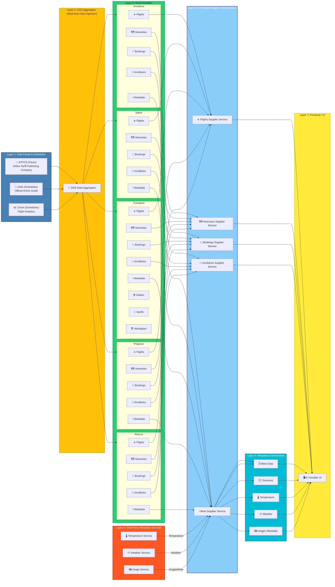

# Supplier stream project

```mermaid
flowchart LR

  %% --- LAYER 1: DATA FEEDS ---
  subgraph DataFeeds["Layer 1: Data Feeds & Schedules"]
    direction LR
    ATPCO["🛫 ATPCO (Fares)\nAirline Tariff Publishing Company"]
    OAG["📅 OAG (Schedules)\nOfficial Airline Guide"]
    Cirium["📊 Cirium (Schedules)\nFlight Analytics"]
  end

  %% --- LAYER 2: AGGREGATOR ---
  subgraph Aggregator["Layer 2: GDS Aggregator\n(Real-time Data Ingestion)"]
    direction LR
    GDSAggregator["🔄 GDS Data Aggregator"]
  end

  %% --- LAYER 3: PROVIDERS LAYER (horizontal providers) ---
  subgraph ProvidersLayer["Layer 3: GDS Providers"]
    direction LR
    AmadeusBlock["Amadeus"]
    SabreBlock["Sabre"]
    TravelportBlock["Travelport"]
    PegasusBlock["Pegasus"]
    AbacusBlock["Abacus"]
  end

  subgraph AmadeusBlock["Amadeus"]
    direction LR
    AFlights["✈️ Flights"]
    AItineraries["🗺️ Itineraries"]
    ABookings["📔 Bookings"]
    AMeta["ℹ️ Metadata"]
    AAncillaries["🎒 Ancillaries"]
  end

  subgraph SabreBlock["Sabre"]
    direction LR
    SFlights["✈️ Flights"]
    SItineraries["🗺️ Itineraries"]
    SBookings["📔 Bookings"]
    SMeta["ℹ️ Metadata"]
    SAncillaries["🎒 Ancillaries"]
  end

  subgraph TravelportBlock["Travelport"]
    direction LR
    TFlights["✈️ Flights"]
    TItineraries["🗺️ Itineraries"]
    TBookings["📔 Bookings"]
    TMeta["ℹ️ Metadata"]
    TAncillaries["🎒 Ancillaries"]
    Galileo["🌐 Galileo"]
    Apollo["🚀 Apollo"]
    Worldspan["🌎 Worldspan"]
  end

  subgraph PegasusBlock["Pegasus"]
    direction LR
    PFlights["✈️ Flights"]
    PItineraries["🗺️ Itineraries"]
    PBookings["📔 Bookings"]
    PMeta["ℹ️ Metadata"]
    PAncillaries["🎒 Ancillaries"]
  end

  subgraph AbacusBlock["Abacus"]
    direction LR
    ABFlights["✈️ Flights"]
    ABItineraries["🗺️ Itineraries"]
    ABBookings["📔 Bookings"]
    ABMeta["ℹ️ Metadata"]
    ABAncillaries["🎒 Ancillaries"]
  end

  %% --- LAYER 4: E-TRAVELLER MICROSERVICES ---
  subgraph ETravellerMicroservices["Layer 4: E-Traveller Supplier Microservices"]
    direction LR
    FlightsSupplierService["✈️ Flights Supplier Service"]
    ItinerariesSupplierService["🗺️ Itineraries Supplier Service"]
    BookingsSupplierService["📔 Bookings Supplier Service"]
    MetaSupplierService["ℹ️ Meta Supplier Service"]
    AncillariesSupplierService["🎒 Ancillaries Supplier Service"]
  end

  %% --- LAYER 5: THIRD PARTY SERVICES ---
  subgraph ThirdPartyServices["Layer 5: Third-Party Metadata Services"]
    direction LR
    ThirdPartyTemp["🌡️ Temperature Service"]
    ThirdPartyWeather["⛅ Weather Service"]
    ThirdPartyImages["🖼️ Image Service"]
  end

  %% --- LAYER 6: API/METADATA ---
  subgraph MetaDataLayer["Layer 6: Metadata & Enrichment"]
    direction LR
    MetaData["🗄️ Meta Data"]
    Timezone["🕒 Timezone"]
    Temperature["🌡️ Temperature"]
    Weather["⛅ Weather"]
    ImagesMeta["🖼️ Images Metadata"]
  end

  %% --- LAYER 7: FRONTEND/UI ---
  subgraph UILayer["Layer 7: Frontend / UI"]
    direction LR
    UIStream["🖥️ E-Traveller UI"]
  end

  %% --- CONNECTIONS ---
  ATPCO --> GDSAggregator
  OAG --> GDSAggregator
  Cirium --> GDSAggregator

  GDSAggregator --> AmadeusBlock
  GDSAggregator --> SabreBlock
  GDSAggregator --> TravelportBlock
  GDSAggregator --> PegasusBlock
  GDSAggregator --> AbacusBlock

  AFlights --> FlightsSupplierService
  SFlights --> FlightsSupplierService
  TFlights --> FlightsSupplierService
  PFlights --> FlightsSupplierService
  ABFlights --> FlightsSupplierService

  AItineraries --> ItinerariesSupplierService
  SItineraries --> ItinerariesSupplierService
  TItineraries --> ItinerariesSupplierService
  PItineraries --> ItinerariesSupplierService
  ABItineraries --> ItinerariesSupplierService

  ABookings --> BookingsSupplierService
  SBookings --> BookingsSupplierService
  TBookings --> BookingsSupplierService
  PBookings --> BookingsSupplierService
  ABBookings --> BookingsSupplierService

  AMeta --> MetaSupplierService
  SMeta --> MetaSupplierService
  TMeta --> MetaSupplierService
  PMeta --> MetaSupplierService
  ABMeta --> MetaSupplierService

  AAncillaries --> AncillariesSupplierService
  SAncillaries --> AncillariesSupplierService
  TAncillaries --> AncillariesSupplierService
  PAncillaries --> AncillariesSupplierService
  ABAncillaries --> AncillariesSupplierService

  FlightsSupplierService --> UIStream
  ItinerariesSupplierService --> UIStream
  BookingsSupplierService --> UIStream
  MetaSupplierService --> MetaData
  AncillariesSupplierService --> UIStream

  ThirdPartyTemp -- Temperature --> MetaSupplierService
  ThirdPartyWeather -- Weather --> MetaSupplierService
  ThirdPartyImages -- ImagesMeta --> MetaSupplierService

  MetaSupplierService --> MetaData
  MetaSupplierService --> Timezone
  MetaSupplierService --> Temperature
  MetaSupplierService --> Weather
  MetaSupplierService --> ImagesMeta

  MetaData --> UIStream
  Timezone --> UIStream
  Temperature --> UIStream
  Weather --> UIStream
  ImagesMeta --> UIStream

  %% --- COLORS & STYLES WITH DISTINCT RGBs ---
  classDef feeds fill:#4682B4,stroke:#1E3C78,color:#fff,stroke-width:2px;
  classDef aggregator fill:#FFC107,stroke:#DAA520,color:#3E2723,stroke-width:2px;
  classDef provider fill:#2ECC71,stroke:#16A085,color:#00321E,stroke-width:2px;
  classDef etrav fill:#87CEFA,stroke:#7B1FA2,color:#fff,stroke-width:2px;
  classDef thirdparty fill:#FF5722,stroke:#BF360C,color:#fff,stroke-width:2px;
  classDef metadata fill:#00BCD4,stroke:#006064,color:#fff,stroke-width:2px;
  classDef frontend fill:#FFEB3B,stroke:#FFC107,color:#3E2723,stroke-width:2px;

  class DataFeeds feeds;
  class Aggregator aggregator;
  class ProvidersLayer provider;
  class ETravellerMicroservices etrav;
  class ThirdPartyServices thirdparty;
  class MetaDataLayer metadata;
  class UILayer frontend;
```
