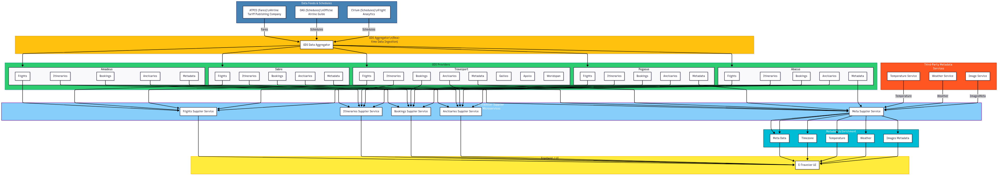

# Supplier stream project

```mermaid
flowchart TB

  %% --- LAYER 1: DATA FEEDS ---
  subgraph DataFeeds["Data Feeds & Schedules"]
    direction TB
    ATPCO["ATPCO (Fares)\nAirline Tariff Publishing Company"]
    OAG["OAG (Schedules)\nOfficial Airline Guide"]
    Cirium["Cirium (Schedules)\nFlight Analytics"]
  end

  %% --- LAYER 2: AGGREGATOR ---
  subgraph Aggregator["GDS Aggregator\n(Real-time Data Ingestion)"]
    direction TB
    GDSAggregator["GDS Data Aggregator"]
  end

  %% --- LAYER 3: PROVIDERS LAYER ---
  subgraph ProvidersLayer["GDS Providers"]
    direction LR
    subgraph AmadeusBlock["Amadeus"]
      direction TB
      AFlights["Flights"]
      AItineraries["Itineraries"]
      ABookings["Bookings"]
      AMeta["Metadata"]
      AAncillaries["Ancillaries"]
    end

    subgraph SabreBlock["Sabre"]
      direction TB
      SFlights["Flights"]
      SItineraries["Itineraries"]
      SBookings["Bookings"]
      SMeta["Metadata"]
      SAncillaries["Ancillaries"]
    end

    subgraph TravelportBlock["Travelport"]
      direction TB
      TFlights["Flights"]
      TItineraries["Itineraries"]
      TBookings["Bookings"]
      TMeta["Metadata"]
      TAncillaries["Ancillaries"]
      Galileo["Galileo"]
      Apollo["Apollo"]
      Worldspan["Worldspan"]
    end

    subgraph PegasusBlock["Pegasus"]
      direction TB
      PFlights["Flights"]
      PItineraries["Itineraries"]
      PBookings["Bookings"]
      PMeta["Metadata"]
      PAncillaries["Ancillaries"]
    end

    subgraph AbacusBlock["Abacus"]
      direction TB
      ABFlights["Flights"]
      ABItineraries["Itineraries"]
      ABBookings["Bookings"]
      ABMeta["Metadata"]
      ABAncillaries["Ancillaries"]
    end
  end

  %% --- LAYER 4: E-TRAVELLER MICROSERVICES ---
  subgraph ETravellerMicroservices["E-Traveller Supplier Microservices"]
    direction TB
    FlightsSupplierService["Flights Supplier Service"]
    ItinerariesSupplierService["Itineraries Supplier Service"]
    BookingsSupplierService["Bookings Supplier Service"]
    MetaSupplierService["Meta Supplier Service"]
    AncillariesSupplierService["Ancillaries Supplier Service"]
  end

  %% --- LAYER 5: THIRD PARTY SERVICES ---
  subgraph ThirdPartyServices["Third-Party Metadata Services"]
    direction TB
    ThirdPartyTemp["Temperature Service"]
    ThirdPartyWeather["Weather Service"]
    ThirdPartyImages["Image Service"]
  end

  %% --- LAYER 6: API/METADATA ---
  subgraph MetaDataLayer["Metadata & Enrichment"]
    direction TB
    MetaData["Meta Data"]
    Timezone["Timezone"]
    Temperature["Temperature"]
    Weather["Weather"]
    ImagesMeta["Images Metadata"]
  end

  %% --- LAYER 7: FRONTEND/UI ---
  subgraph UILayer["Frontend / UI"]
    direction TB
    UIStream["E-Traveller UI"]
  end

  %% --- CONNECTIONS ---
  ATPCO -->|Fares| GDSAggregator
  OAG -->|Schedules| GDSAggregator
  Cirium -->|Schedules| GDSAggregator

  GDSAggregator --> AmadeusBlock
  GDSAggregator --> SabreBlock
  GDSAggregator --> TravelportBlock
  GDSAggregator --> PegasusBlock
  GDSAggregator --> AbacusBlock

  %% PROVIDER OUTPUTS TO MICROSERVICES
  AFlights --> FlightsSupplierService
  SFlights --> FlightsSupplierService
  TFlights --> FlightsSupplierService
  PFlights --> FlightsSupplierService
  ABFlights --> FlightsSupplierService

  AItineraries --> ItinerariesSupplierService
  SItineraries --> ItinerariesSupplierService
  TItineraries --> ItinerariesSupplierService
  PItineraries --> ItinerariesSupplierService
  ABItineraries --> ItinerariesSupplierService

  ABookings --> BookingsSupplierService
  SBookings --> BookingsSupplierService
  TBookings --> BookingsSupplierService
  PBookings --> BookingsSupplierService
  ABBookings --> BookingsSupplierService

  AMeta --> MetaSupplierService
  SMeta --> MetaSupplierService
  TMeta --> MetaSupplierService
  PMeta --> MetaSupplierService
  ABMeta --> MetaSupplierService

  AAncillaries --> AncillariesSupplierService
  SAncillaries --> AncillariesSupplierService
  TAncillaries --> AncillariesSupplierService
  PAncillaries --> AncillariesSupplierService
  ABAncillaries --> AncillariesSupplierService

  %% SUPPLIER MICROSERVICES TO METADATA LAYER
  FlightsSupplierService --> UIStream
  ItinerariesSupplierService --> UIStream
  BookingsSupplierService --> UIStream
  MetaSupplierService --> MetaData
  AncillariesSupplierService --> UIStream

  %% THIRD PARTY TO METADATA
  ThirdPartyTemp -- Temperature --> MetaSupplierService
  ThirdPartyWeather -- Weather --> MetaSupplierService
  ThirdPartyImages -- ImagesMeta --> MetaSupplierService

  MetaSupplierService --> MetaData
  MetaSupplierService --> Timezone
  MetaSupplierService --> Temperature
  MetaSupplierService --> Weather
  MetaSupplierService --> ImagesMeta

  %% METADATA TO UI
  MetaData --> UIStream
  Timezone --> UIStream
  Temperature --> UIStream
  Weather --> UIStream
  ImagesMeta --> UIStream

  %% --- COLORS & STYLES WITH DISTINCT RGBs ---
  classDef feeds fill:#4682B4,stroke:#1E3C78,color:#fff,stroke-width:2px;
  classDef aggregator fill:#FFC107,stroke:#DAA520,color:#3E2723,stroke-width:2px;
  classDef provider fill:#2ECC71,stroke:#16A085,color:#00321E,stroke-width:2px;
  classDef etrav fill:#87CEFA,stroke:#7B1FA2,color:#fff,stroke-width:2px;
  classDef thirdparty fill:#FF5722,stroke:#BF360C,color:#fff,stroke-width:2px;
  classDef metadata fill:#00BCD4,stroke:#006064,color:#fff,stroke-width:2px;
  classDef frontend fill:#FFEB3B,stroke:#FFC107,color:#3E2723,stroke-width:2px;

  class DataFeeds feeds;
  class Aggregator aggregator;
  class ProvidersLayer provider;
  class ETravellerMicroservices etrav;
  class ThirdPartyServices thirdparty;
  class MetaDataLayer metadata;
  class UILayer frontend;
```